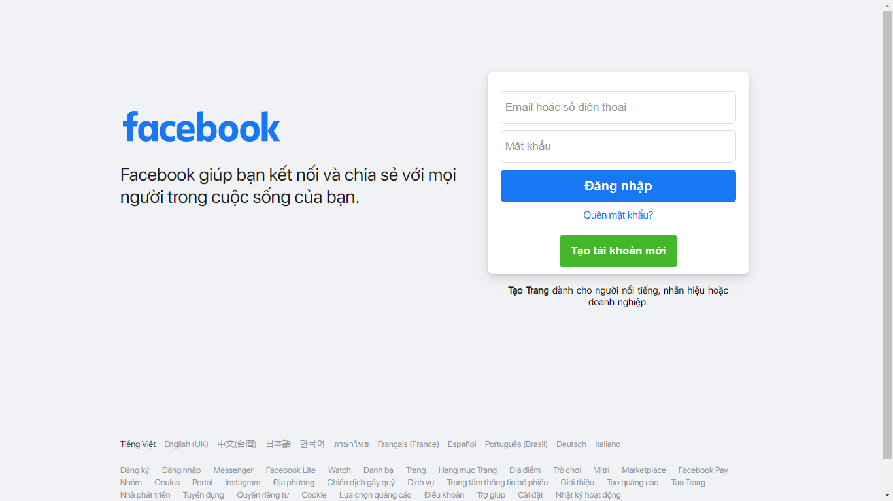
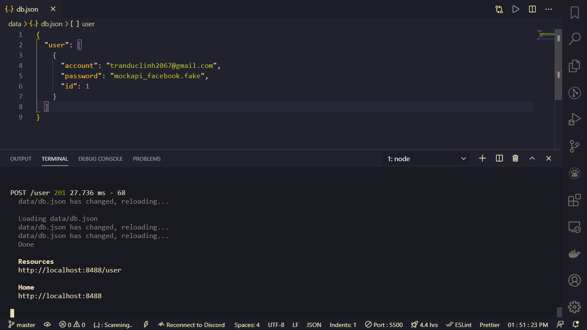
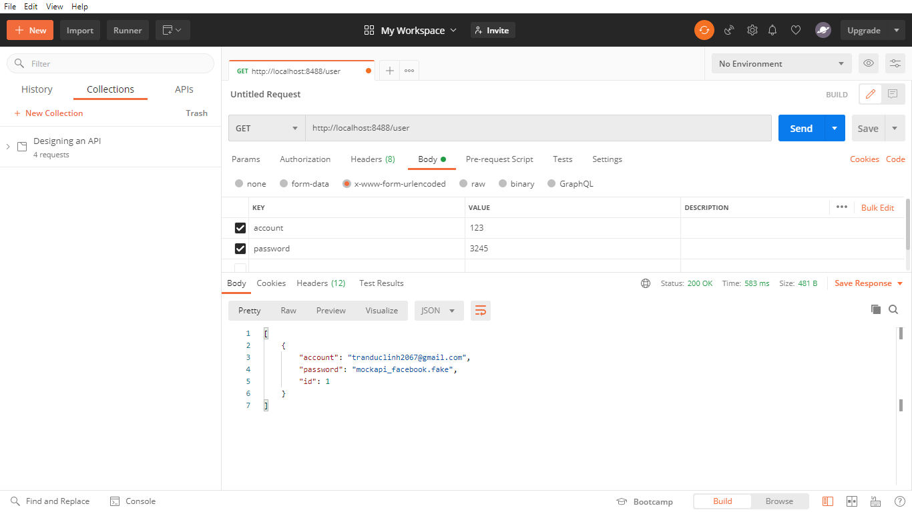

#### MockAPI với giao diện Facebook.

Project mô phỏng cho *Vi* và mọi người nhận biết cách lấy 1 tài khoản Facebook như thế nào...

#### Các bước thực hiện...

> Clone project
>> 1) Clone project: **git clone https://github.com/tranduclinh2067/MockAPI_facebook.git**
>> 2) **npm i**
>> 3) **npm start**
>> 4) Open file **index.htmk** in Browser.
>> 5) Login and see file **data/db.json**

#### Pictures

